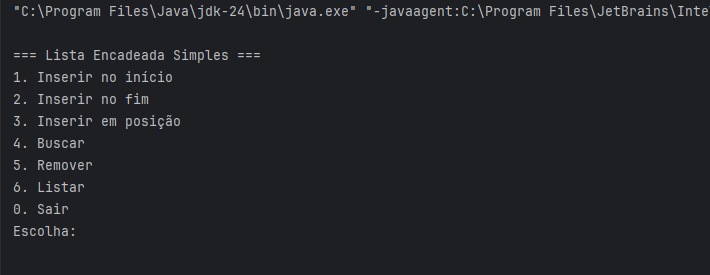
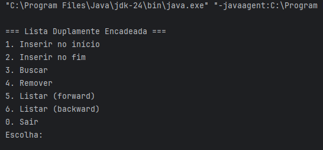

# 🧩 Estruturas de Dados em Java  
Implementação das três principais **listas encadeadas** — **Simples**, **Dupla** e **Circular** — em Java, com menus interativos no terminal.  

Cada estrutura foi desenvolvida **sem utilizar coleções prontas** (como `ArrayList` ou `LinkedList`), para reforçar o entendimento dos conceitos de ponteiros, nós e ligações entre elementos.

---

## 📚 Estruturas Implementadas

### 🔹 1. Lista Encadeada Simples (`ListaSimples`)
A **lista simples** é formada por nós que armazenam um valor e uma referência para o próximo nó.  
Permite percorrer os elementos **em uma única direção**.

**Operações implementadas:**
- Inserir no início, fim ou posição específica.  
- Buscar um valor.  
- Remover um valor.  
- Listar todos os elementos.

**Representação:**
```
[10] → [20] → [30] → null
```

---

### 🔹 2. Lista Duplamente Encadeada (`ListaDupla`)
Na **lista dupla**, cada nó contém ponteiros para o **próximo e o anterior**, permitindo navegação nos dois sentidos.

**Operações implementadas:**
- Inserir no início e no fim.  
- Buscar um valor.  
- Remover um valor.  
- Listar de forma direta (head → tail) e reversa (tail → head).

**Representação:**
```
null ← [10] ⇄ [20] ⇄ [30] → null
```

---

### 🔹 3. Lista Encadeada Circular (`ListaCircular`)
Na **lista circular**, o último nó aponta novamente para o primeiro, formando um **ciclo contínuo**.

**Operações implementadas:**
- Inserir no início e no fim.  
- Buscar um valor.  
- Remover um valor.  
- Listar todos os elementos de forma circular.

**Representação:**
```
[10] → [20] → [30]
```

---

## 🧪 Exemplos de Uso (Saídas do Programa)

### ✅ Lista Simples
```
=== Lista Encadeada Simples ===
1. Inserir no início
2. Inserir no fim
3. Inserir em posição
4. Buscar
5. Remover
6. Listar
0. Sair
Escolha: 2
Valor: 10
=> Inserido no fim.
Escolha: 2
Valor: 20
=> Inserido no fim.
Escolha: 6
Lista: 10 -> 20 -> null
```

---

### ✅ Lista Dupla
```
=== Lista Duplamente Encadeada ===
1. Inserir no início
2. Inserir no fim
3. Buscar
4. Remover
5. Listar (forward)
6. Listar (backward)
0. Sair
Escolha: 1
Valor: 50
=> Inserido no início.
Escolha: 5
Lista forward: 50 <-> null
```

---

### ✅ Lista Circular
```
=== Lista Encadeada Circular ===
1. Inserir no início
2. Inserir no fim
3. Buscar
4. Remover
5. Listar
0. Sair
Escolha: 2
Valor: 100
=> Inserido no fim.
Escolha: 5
Lista: 100 -> (back to head)
```

---

## 🏁 Conclusão
Este projeto demonstra o funcionamento das **estruturas encadeadas fundamentais** da Computação, evidenciando:
- Como nós se conectam entre si.  
- Diferenças entre encadeamento simples, duplo e circular.  
- A importância de manipular referências e ponteiros corretamente.  

📌 Cada estrutura é executável separadamente e pode ser facilmente adaptada para armazenar objetos (ex.: alunos, produtos, etc.).

---

## 📷 Prints de Execução

### Lista Simples


### Lista Dupla


### Lista Circular


---

## 📽️ Demonstração em Vídeo

🎥 Assista ao vídeo explicativo no YouTube:  
👉 [https://youtu.be/pluprDYkDnI](https://youtu.be/pluprDYkDnI)
